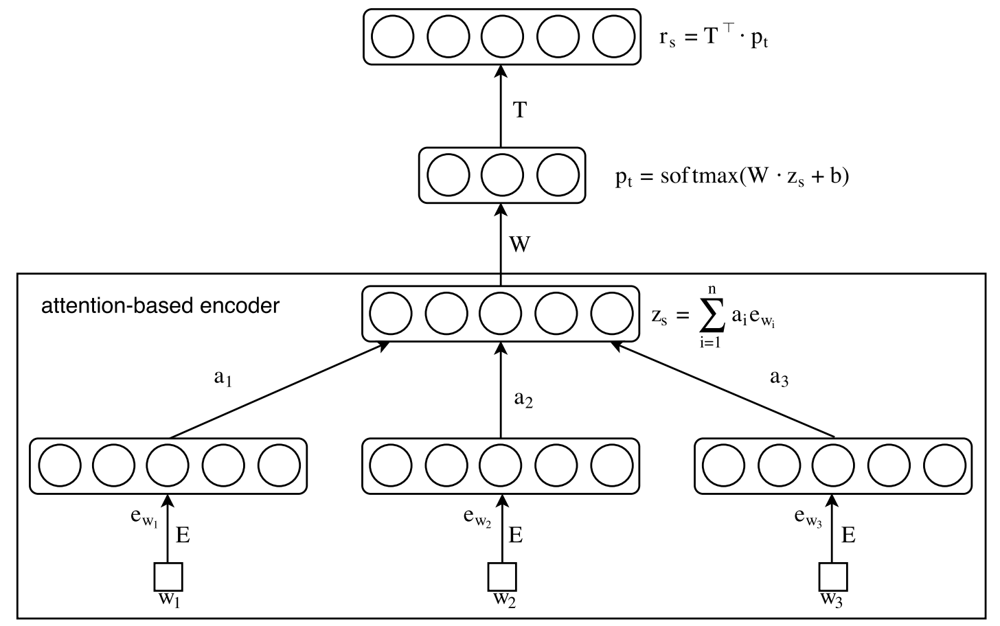

# Torch-Unsupervised-Aspect-Extraction

Pytorch implementation for ACL2017 paper "An unsupervised neural attention model for aspect extraction" ([pdf](http://aclweb.org/anthology/P/P17/P17-1036.pdf))

[Original code](https://github.com/ruidan/Unsupervised-Aspect-Extraction)

### Model

<div align=center>

</div>


### Dependency

While this implement might work for many cases, it is only tested for environment below:

```
python == 3.7.0
torch == 0.4.1
tqdm
numpy
Keras == 2.2.4
```

### Usage

```bash
python3 main.py
```

### Citation

If you find this work is useful in your research, please consider citing:

```
@InProceedings{he-EtAl:2017:Long2,
  author    = {He, Ruidan  and  Lee, Wee Sun  and  Ng, Hwee Tou  and  Dahlmeier, Daniel},
  title     = {An Unsupervised Neural Attention Model for Aspect Extraction},
  booktitle = {Proceedings of the 55th Annual Meeting of the Association for Computational Linguistics (Volume 1: Long Papers)},
  month     = {July},
  year      = {2017},
  address   = {Vancouver, Canada},
  publisher = {Association for Computational Linguistics}
}
```